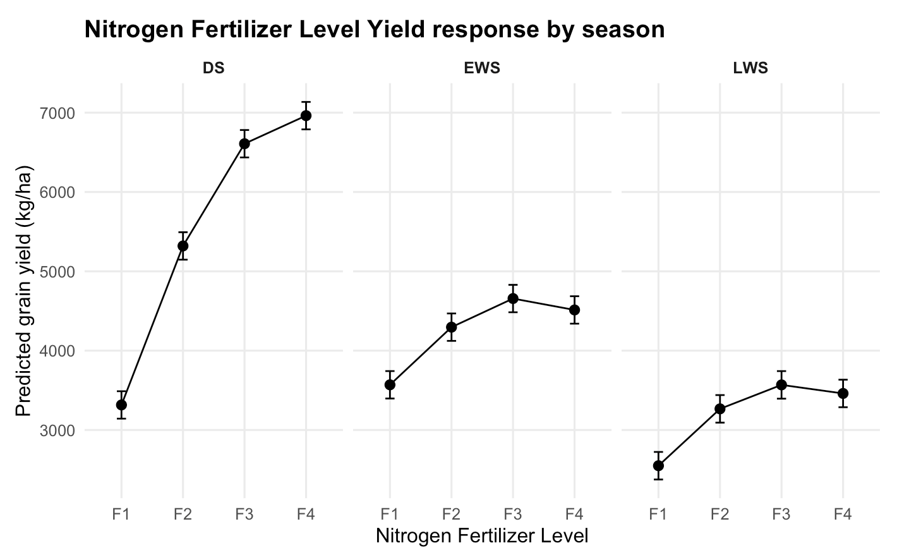
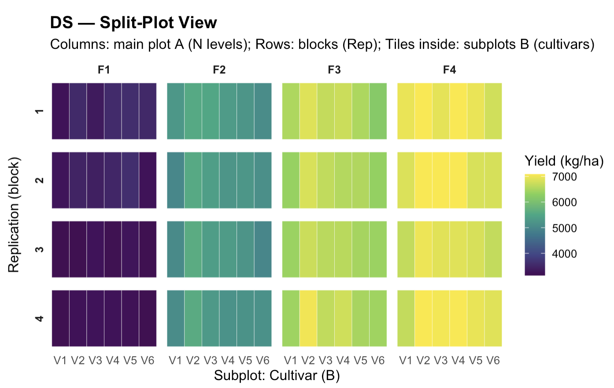
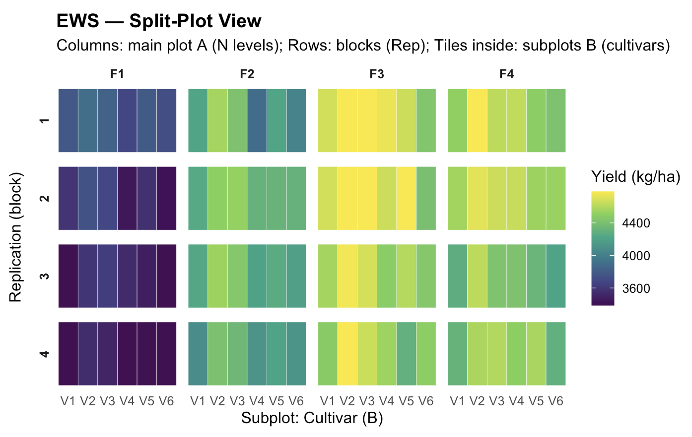

# Field Trial Mixed-Model Analysis (1968–2023)
**Evaluating nitrogen response & cultivar performance in long-term irrigated rice trials**

This project presents an agronomic statistics workflow using linear mixed-effects models over more than 50 years of irrigated rice field trials.  
It reflects the analytical practices used in crop R&D, biological product evaluation, and field trial analytics.

---

## 📌 Objectives

- Model grain yield response to nitrogen across seasons  
- Evaluate cultivar performance and stability across environments  
- Correctly represent a multi-year **split-plot RCBD**  
- Generate agronomic insights backed by mixed-model inference  
- Perform field-layout QC to evaluate block/subplot structure  

---

## 🧪 Experimental Design

| Feature | Description |
|---|---|
Crop | Irrigated rice (triple-crop system) |
Years | 1968–2023 |
Design | Split-plot RCBD |
Main plot (A) | Nitrogen rate (F1–F4) |
Subplot (B) | Cultivar (V1–V6) |
Blocks | 4 replications per year |
Seasons | DS (Dry), EWS, LWS |
Outcome | Grain yield (kg/ha) |
Model | `Season × A × B + (1 | Year/Rep)` |

---

## 🧰 Software

- **R**: lme4, lmerTest, emmeans, dplyr, ggplot2  
- Reporting: RMarkdown

---

## 📊 Key Findings

### Nitrogen
- Strongest nitrogen effect in **Dry Season**
- **Plateau beyond F3** in wet seasons  
- Lower N-use efficiency under wet-season stress (humidity, disease pressure, radiation limits)

### Cultivar
- **V4** consistently highest & stable  
- **V1** lowest performing  
- Genetic differences are expressed most strongly in DS conditions

---

## 🌾 Agronomic Recommendations

| Season | Recommended N | Insight |
|---|---|---|
Dry (DS) | F4 | Most favorable environment and highest N efficiency |
Early Wet (EWS) | F3 | Marginal return beyond F3 |
Late Wet (LWS) | F3 | Stress limits crop response |

**Cultivar Recommendation:** Prefer **V4**; avoid **V1**.

---

## 📈 Visual Outputs

**Treatment Response Plots:**

**Split-Plot Layout QC:**

---

## 📙 Methods

- Linear mixed-effects model
- Tukey adjusted marginal means
- Model hierarchy + interaction testing
- Confidence interval-based inference
- Agronomic interpretation & N-rate optimization

---

## 🔜 Future Extensions

- ✅ Spatial interpolation (kriging) for precision-ag layout
- ✅ Field-zone nitrogen recommendation maps
- ⏳ Random-slope G×E stability modeling (AMMI / GGE)
- ⏳ Power analysis for trial design efficiency

---

